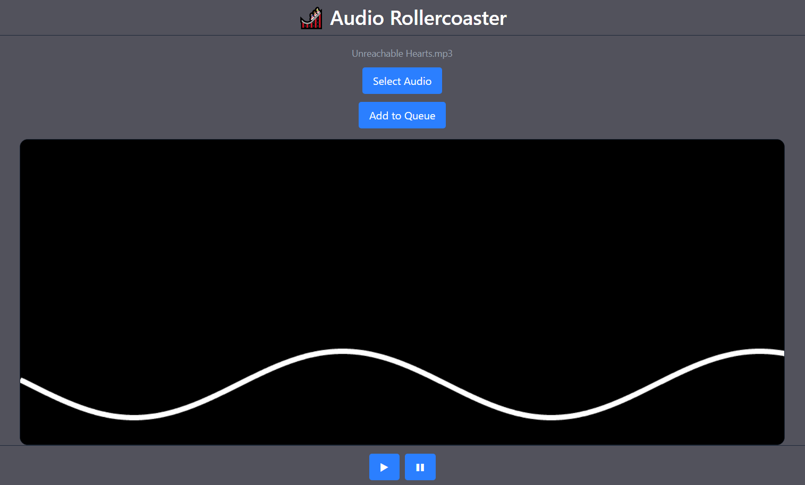

# 🎢 Music Rollercoaster Visualizer

A browser-based audio visualizer that analyzes uploaded music and generates a procedural rollercoaster track in real time.

---

## Demo

> [to do: add link]

---

## Concept

This project transforms audio into motion.

- Music is analyzed using the Web Audio API
- Frequency data drives procedural track generation
- A “cart” moves along the track in sync with the music

The goal is to simulate a rollercoaster ride that _reacts_ to sound.

---

## Tech Stack

**Frontend**

- React (UI layer)
- Vite (dev/build tool)
- Tailwind CSS (styling)

**Engine**

- HTML5 Canvas (rendering)
- Vanilla JavaScript (animation loop)
- Web Audio API (audio analysis)

---

## Architecture

The app is intentionally split into two layers:

```txt
React (UI)
  ├── Controls (upload, play, etc.)
  └── Canvas component

Engine (Vanilla JS)
  ├── Audio analysis
  ├── Track generation
  └── Rendering loop (requestAnimationFrame)
```

> React manages UI state only — the rendering engine runs independently for performance.

---

## Features (As of Late)

- File upload (MP3/audio)
- Real-time canvas rendering loop
- Procedural sine wave-based track
- Moving “cart” along generated path
- Responsive layout with header / controls

---

## Planned Features

- Audio-driven track generation (replace sine wave)
- Frequency-based terrain (bass = drops, highs = twists)
- Camera movement / perspective (3D)
- Track smoothing & physics tuning
- Queue system for multiple songs
- Play/pause controls

---

## Screenshots

<p align="center">

</p>

---

## Getting Started

```bash
git clone https://github.com/vvt3/audio-visualiser.git
cd audio-visualiser
npm install
npm run dev
```

---

## Project Structure

```txt
src/
├── components/
│   ├── Canvas.jsx
│   └── MusicInput.jsx
├── engine/
├── App.jsx
└── main.jsx
```

---

## Key Learning Points

- Separating UI (React) from a real-time rendering engine
- Using requestAnimationFrame for smooth animation
- Working with raw audio data in the browser
- Managing performance in interactive applications

---

## Why This Project?

Most frontend projects are CRUD apps.

This project demonstrates:

- real-time systems thinking
- creative coding
- performance awareness
- deeper understanding of JavaScript beyond frameworks

This is simply fun to see it work

---

## Status

In active development

<p align="center">

</p>

---

## Contact

- https://github.com/vvt3/
- https://www.linkedin.com/in/vvt3/
